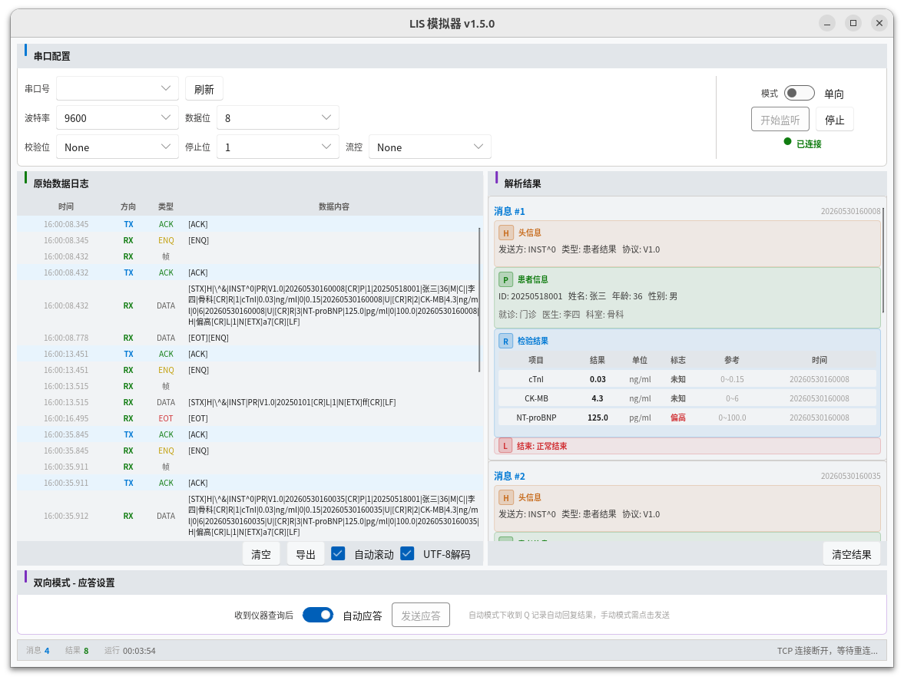

# LIS 模拟器

基于 ASTM E1381/E1394 协议的实验室信息系统（LIS）模拟器，用于测试医疗检验仪器的串口通信功能。

**跨平台支持**：Windows / Linux



## 功能特性

- **协议实现**：完整支持 ASTM E1381 传输层与 E1394 数据内容标准
- **通信模式**：支持单向（接收结果）与双向（查询/应答）两种 LIS 工作模式
- **数据解析**：实时解析 H/P/O/R/L/Q/C 记录，结构化展示检验结果
- **传输方式**：支持传统串口（RS232）和 TCP 网络通信
- **调试工具**：原始数据日志、HEX 显示、UTF-8 解码、数据导出

## 技术栈

| 组件     | 技术                                          |
| -------- | --------------------------------------------- |
| 语言     | Rust (Edition 2021)                           |
| UI 框架  | [Slint](https://slint.dev) (Fluent 风格)      |
| 串口通信 | [serialport](https://docs.rs/serialport) 4.x |
| 集成测试 | Python 3 + pyserial                           |

## 构建与运行

### 环境要求

- Rust 工具链（推荐通过 [rustup](https://rustup.rs) 安装）
- Windows：MSVC Build Tools
- Linux：`build-essential`、`pkg-config`、`libfontconfig-dev`

### 编译

```bash
cargo build --release
```

### 运行

```bash
cargo run --release
```

## 使用说明

1. 启动程序，在配置面板选择串口号/波特率或 TCP 模式
2. 选择单向或双向通信模式
3. 点击 **开始监听**
4. 仪器发送数据后，原始日志和解析结果实时显示

## 测试

### 单元测试与集成测试

```bash
cargo test
```

### TCP 无头模式（无需物理串口）

```bash
# 终端 1：启动无头 TCP 服务器
cargo run -- --headless --tcp 12345

# 终端 2：运行测试脚本
python tests/test_tcp.py --port 12345
```

### 串口模式（需要 com0com 或物理串口线）

```bash
# 终端 1：启动 GUI
cargo run

# 终端 2：模拟仪器端
python tests/instrument_simulator.py --port COM11 --baud 9600
```

## 协议参考

| 记录类型 | 说明 |
|---------|------|
| `H\|` | Header Record - 消息头 |
| `P\|` | Patient Record - 患者信息 |
| `O\|` | Order Record - 检验申请 |
| `R\|` | Result Record - 检验结果 |
| `Q\|` | Request Record - 查询请求（双向模式） |
| `C\|` | Comment Record - 备注 |
| `L\|` | Terminator Record - 结束标记 |

## License

Copyright (C) 2026 Mq-b

本项目基于 [GPL-3.0](LICENSE) 许可证开源。
