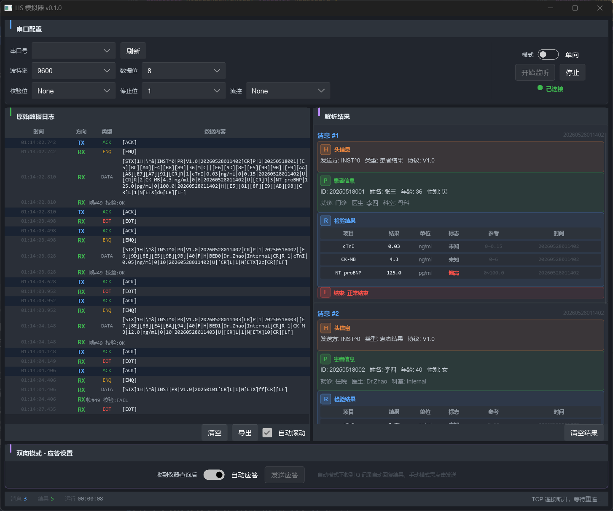

# LIS 模拟器

基于 ASTM E1381/E1394 协议的实验室信息系统（LIS）模拟器，用于测试医疗检验仪器的串口通信功能。




## 功能

- **模拟 LIS 端**：通过 RS232 串口接收仪器发送的 ASTM 协议数据
- **单向/双向模式**：支持仅接收结果（单向）和查询/应答（双向）两种通信模式
- **实时数据解析**：自动解析 H/P/O/R/L/Q/C 记录，结构化展示检验结果
- **原始日志**：记录所有收发数据，支持 HEX 显示和导出
- **协议兼容**：校验和计算、握手流程与主流仪器实现一致

## 技术栈

- **语言**：Rust
- **UI**：[Slint](https://slint.dev) (fluent 风格)
- **串口**：[serialport](https://docs.rs/serialport) crate

## 构建

```bash
# 需要 Rust 工具链和 MSVC Build Tools
cargo build --release

# 运行
cargo run --release
```

## 使用

1. 启动程序，在串口配置面板选择串口号和波特率
2. 选择单向或双向模式
3. 点击"开始监听"
4. 仪器发送数据后，原始日志和解析结果会实时显示

## 测试

### TCP 无头模式（推荐，无需物理串口）

```bash
# 启动无头 TCP 服务器
cargo run -- --headless --tcp 12345

# 另一个终端运行测试脚本
python tests/test_tcp.py --port 12345
```

### 串口模式（需要 com0com 或物理串口线）

```bash
# 启动 GUI，连接串口
cargo run

# 用测试脚本模拟仪器端
python tests/instrument_simulator.py --port COM11 --baud 9600
```

### 运行全部自动化测试

```bash
cargo test
```

## 协议参考

本项目实现基于 ASTM E1381（传输层）和 E1394（数据内容）标准：

| 记录类型 | 说明 |
|---------|------|
| H\| | Header Record - 消息头 |
| P\| | Patient Record - 患者信息 |
| O\| | Order Record - 检验申请 |
| R\| | Result Record - 检验结果 |
| Q\| | Request Record - 查询请求（双向） |
| C\| | Comment Record - 备注 |
| L\| | Terminator Record - 结束标记 |

## License

MIT
